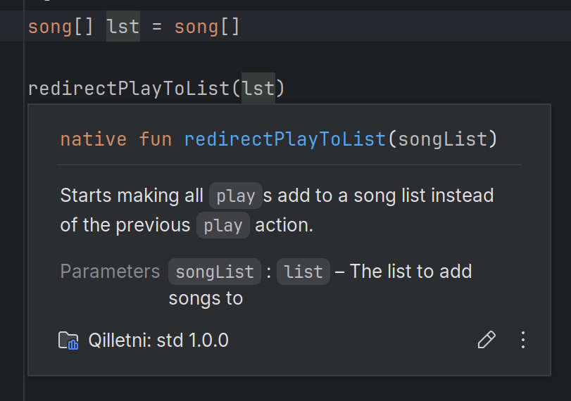

# Qilletni IntelliJ Plugin

This is an IntelliJ plugin for the [Qilletni](https://qilletni.dev/) language, which is a DSL providing first-class support for music streaming/tracking services. This language currently supports Spotify, Last.Fm, and Tidal is in development.

This plugin primarily does the following:
- Syntax highlighting
- Error checking
- Auto completions for Spotify tracks, playlists, and artists (More services planned)
- References/highlight usages/go-to's in Qilletni
- Inspections for adding music
- Building and execution of programs
- Library indexing
- Linking between qilletni_info.yml native Java methods references
- Documentation rendering

As a warning, unlike the rest of Qilletni/its ecosystem, this plugin was written ~80% with various AI tools. This was both to experiment with tools, and because I really dislike writing IDEA plugins.

## Screenshots

_qilletni_info.yml linking to their actual Java classes_

 

_Native Qilletni functions are linked to their Java implementations. Clicking on either will _

 

_Rendering the documentation for redirectPlayToList_

 

 

_Before and after autocomplete of music information. This is context-aware of what is being completed._

_The magnifier glass selector for music, providing a GUI-based selector for songs, tracks, or playlists_
